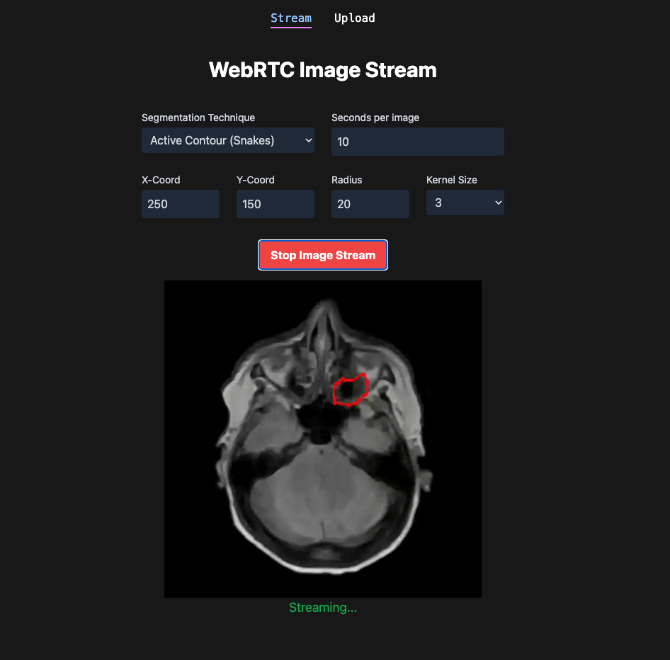

# Medical Image Streaming

A React-based web application for real-time streaming and segmentation of medical DICOM images using WebRTC technology. This frontend provides an intuitive interface for uploading DICOM files and applying advanced computer vision algorithms including Watershed and Active Contours (Snakes) segmentation techniques.

## Table of Contents

- [Features](#features)
- [Technology Stack](#technology-stack)
- [Prerequisites](#prerequisites)
- [Installation](#installation)
- [Development](#development)
- [Backend API Integration](#backend-api-integration)
- [Usage Guide](#usage-guide)
- [Application Interface](#application-interface)
- [Component Architecture](#component-architecture)
- [Project Structure](#project-structure)
- [Build and Deployment](#build-and-deployment)
- [WebRTC Considerations](#webrtc-considerations)
- [Contributing](#contributing)
- [Related Projects](#related-projects)
- [License](#license)

## Features

- **Real-time Medical Image Streaming**: WebRTC-based live streaming of processed DICOM images
- **DICOM File Upload**: Support for uploading multiple medical DICOM (.dcm) files
- **Advanced Segmentation Algorithms**:
  - **Watershed Segmentation**: Configurable threshold ratio and kernel size parameters
  - **Active Contours (Snakes)**: Adjustable initial contour position, radius, and morphological parameters
- **Responsive Design**: Mobile-friendly interface built with Tailwind CSS
- **Stream Management**: Start/stop streaming controls with connection state feedback

## Technology Stack

- **React 18.3.1**: Modern React with hooks and functional components
- **React Router DOM 6.28.0**: Client-side routing and navigation
- **Vite**: Fast build tool and development server
- **Tailwind CSS**: Utility-first CSS framework for responsive design
- **WebRTC API**: Real-time peer-to-peer communication

## Prerequisites

- Node.js 16+ (recommended: Node.js 18+)
- npm or yarn package manager
- Backend [API server](https://github.com/madeleinewoodbury/medical-image-streaming-api) running

## Installation

1. **Clone the repository and navigate to the frontend directory**:
   ```bash
   git clone https://github.com/madeleinewoodbury/medical-image-streaming-app
   cd medical-image-streaming-app
   ```

2. **Install dependencies**:
   ```bash
   npm install
   ```

3. **Configure API endpoints**:
   Ensure your backend server is running on port 8000 and configure your development proxy or production reverse proxy accordingly.

## Development

### Starting the Development Server

```bash
npm run dev
```

The application will be available at `http://localhost:3000`

### Available Scripts

- `npm run dev` - Start development server with hot reload
- `npm run build` - Build the application for production
- `npm run preview` - Preview the production build locally
- `npm run lint` - Run ESLint to check code quality

## Backend API Integration

This frontend application integrates with the Medical Image Streaming API using REST API calls and WebRTC for real-time streaming. The backend must be running for full functionality.

### Communication Architecture

- **REST API**: Standard HTTP requests for file uploads, health checks, and stream initialization
- **WebRTC**: Direct peer-to-peer connection for real-time video streaming of processed medical images  

### API Endpoints Used

- **GET** `/api/images` - Check for available DICOM images
- **POST** `/api/images` - Upload DICOM files
- **POST** `/api/watershed` - Start watershed segmentation stream
- **POST** `/api/snakes` - Start active contours segmentation stream  
- **POST** `/api/stop-stream` - Stop active streaming session

### WebRTC Connection Flow

1. User configures segmentation parameters and clicks "Start Image Stream"
2. Frontend creates RTCPeerConnection and generates WebRTC offer
3. Offer is sent to backend via POST request to segmentation endpoint
4. Backend processes offer and returns WebRTC answer
5. Frontend sets remote description and establishes peer connection
6. Backend streams processed DICOM images in real-time
7. Frontend displays stream in video element

## Usage Guide

### Uploading DICOM Files

1. Navigate to the "Upload" page
2. Click "Select DICOM Files" and choose one or more .dcm files
3. Click "Upload" to send files to the backend
4. Once uploaded successfully, navigate to the streaming page

### Configuring Segmentation Parameters

#### Watershed Segmentation
- **Threshold Ratio** (0.0-1.0): Controls the sensitivity of the watershed algorithm
- **Kernel Size** (3 or 5): Size of the morphological operations kernel
- **Seconds per Image**: Delay between processing each frame

#### Active Contours (Snakes) Segmentation
- **X-Coord & Y-Coord**: Initial center position of the contour
- **Radius**: Initial radius of the circular contour
- **Kernel Size** (3 or 5): Size of the morphological operations kernel
- **Seconds per Image**: Delay between processing each frame

### Starting a Stream

1. Ensure DICOM files are uploaded
2. Select desired segmentation technique (Watershed or Snakes)
3. Adjust parameters as needed
4. Click "Start Image Stream" to begin WebRTC connection
5. View real-time processed images in the video player
6. Click "Stop Image Stream" to end the session

### Application Interface


*The main streaming interface showing WebRTC video player with segmentation parameter controls for Watershed and Active Contours (Snakes) algorithms*

## Component Architecture

```
src/
├── App.jsx                 # Main application with routing
├── main.jsx               # Application entry point
├── index.css              # Global styles
├── components/
│   ├── WebRTCStream.jsx   # Main streaming component with WebRTC logic
│   ├── WatershedInputs.jsx # Watershed parameter controls
│   ├── SnakesInputs.jsx   # Active contours parameter controls
│   └── Navbar.jsx         # Navigation component
├── pages/
│   ├── StreamPage.jsx     # Main streaming page
│   └── Upload.jsx         # DICOM file upload page
└── layout/
    └── MainLayout.jsx     # Application layout wrapper
```

### Key Components

- **WebRTCStream**: Handles WebRTC peer connection, parameter management, and video streaming
- **StreamPage**: Main page that checks for available images and renders the streaming interface
- **Upload**: File upload interface for DICOM files with drag-and-drop support
- **WatershedInputs/SnakesInputs**: Parameter input components for respective segmentation algorithms

## WebRTC Considerations

- **HTTPS Required**: WebRTC requires HTTPS in production environments
- **STUN/TURN Servers**: May be needed for connections across different networks
- **Browser Compatibility**: Modern browsers support WebRTC; ensure compatibility testing
- **Firewall Configuration**: Ensure WebRTC ports are accessible

## Contributing

1. Fork the repository
2. Create a feature branch (`git checkout -b feature/new-feature`)
3. Follow the existing code style and component patterns
4. Test your changes thoroughly
5. Commit your changes (`git commit -am 'Add new feature'`)
6. Push to the branch (`git push origin feature/new-feature`)
7. Create a Pull Request

## Related Projects

- [Medical Image Streaming API](https://github.com/madeleinewoodbury/medical-image-streaming-api) - Backend FastAPI server with DICOM processing

## License

This project is licensed under the MIT License - see the LICENSE file for details.